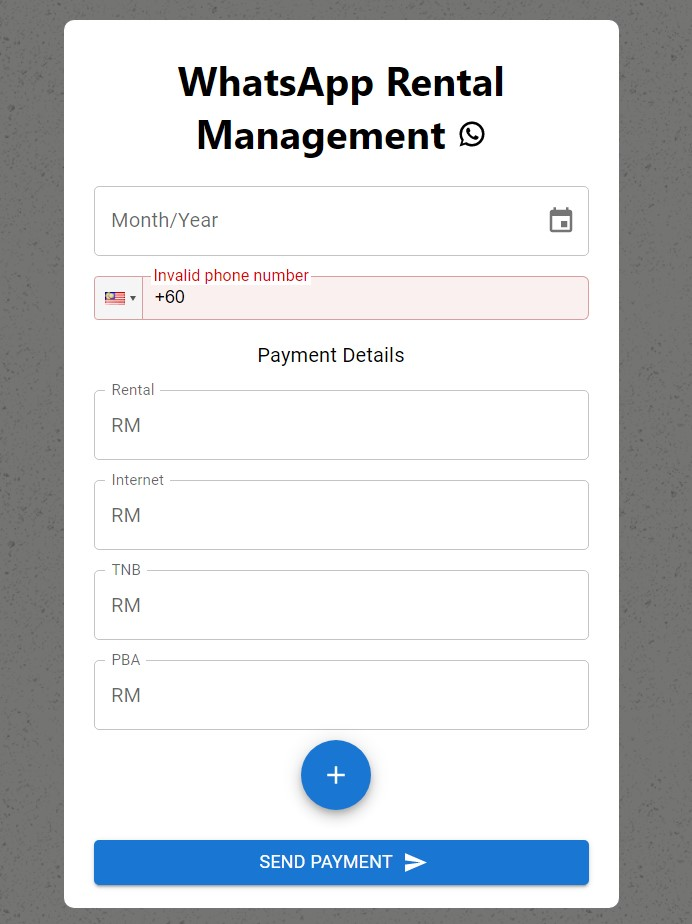
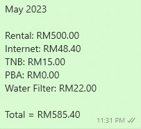

# WhatsApp Rental Management System

Web Form which allow owners to enter rental details and send it through WhatsApp Web.

## Frameworks

Front-end: React + MUI

Back-end: Node + Express

## Project Setup
### Frontend Setup

#### Install Node Dependencies

```
npm install
```

#### Run React Website

```
npm start
```

### Backend Setup

#### Install Node Dependencies

```
npm install
```

#### Run Express Server

```
nodemon server.js
```

## Features
### Home Page


Owners can select the rental month & year, and then enter the contact number of the tenant. 

Then, owners can enter the default payment details or add new payment detail by clicking on the **Add (+)** button and enter the payment title on the dialog prompt.

After all the details are entered, click the **Send Payment** button to send the billing details to the tenant.



## Author

**Yeow Ni Jia**

* [github/DarkerzSonic](https://github.com/DarkerzSonic)
* [LinkedIn/ni-jia-yeow](https://www.linkedin.com/in/ni-jia-yeow/)

## License

Copyright © 2023, [Yeow Ni Jia](https://github.com/DarkerzSonic).
Released under the [MIT License](LICENSE).
